# HCI Gesture Control

In this work, I designed a gesture recognition Human Computer Interaction (HCI) system based on OpenCV.
I used the watershed algorithm to realize skin color image segmentation, applied the template matching algorithm to realize gesture recognition, and implemented the gesture interaction function of mouse and keyboard shortcuts based on Win32 API.

## Features

- Fast gesture recognition
- Keyboard shortcut by fingers
    - [x] Show desktop
    - [x] Starts Windows Coolswitch
- Mouse control by fingers
    - [x] Move
        - Touch Pad
        - Red Dot
    - [x] Click & Hold & Release

## Quick Start

1. Check out this repository and download the source code

    `git clone git@github.com:silvery107/hci-gesture-control.git`

2. Make sure your environment meets this requirements

    ```
    CMake >= 3.0.0
    OpenCV >= 4.2.0
    ```

3. Build executable

    ```shell
    > mkdir build && cd build
    > cmake .. -DCMAKE_BUILD_TYPE=[Debug | Coverage | Release]
    > make
    > cd .. && ./hci-gesture-control
    ```

4. If you want to build it in windows cmd directly, check `build.cmd`

## Demo

[Check this demo video here!](videos/demo.mp4)


## Algorithm



## Reference

[1] 余超. 基于视觉的手势识别研究[D]. 中国科学技术大学, 2015.

[2] 沙亮. 基于无标记全手势视觉的人机交互技术[D]. 清华大学, 2010.

[3] 黄俊.基于视觉的手势识别交互系统设计[D]. 中央民族大学, 2019.
